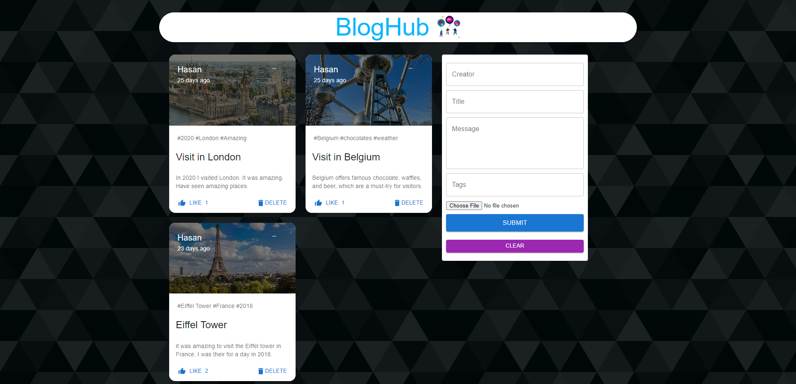

# BlogHub

BlogHub is a event-sharing app that allows users to share their memories and
experiences with others. The app is built on the MERN stack (MongoDB, Express.js,
React, and Node.js) which provides a stable and efficient framework for the app's
development. Users can create posts, add photos, and share their memories
with their friends and family. Additionally, the app has a clean and user-friendly interface, making it easy for
anyone to use. BlogHub can be a great way to document, preserve and share life events
and memories with others. This app is in a continuous development process. User Authentication will be added soon.

## Tech Stack

#### Frontend

- React
- Redux
- Material ui

#### Backend

- Node
- Express
- MongoDB

## Demo

[Live Link](https://bloghubhasan.netlify.app/)

## Screenshots

## Author

- @Hasan Md
- [@Github](https://github.com/hasanmd91?tab=repositories)
- [@Linkedin](https://www.linkedin.com/in/hasanmd91/?originalSubdomain=fi)

## API Reference

- https://memory-social-media.onrender.com/

## Features

- Mobile responsive
- Live previews

## License

[MIT](https://choosealicense.com/licenses/mit/)
